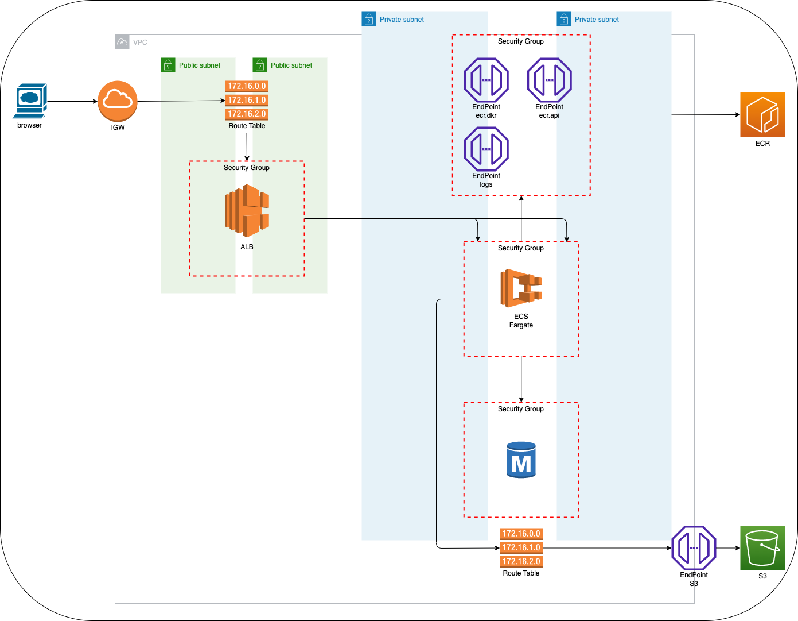

# Fargate with Rails

## 作成したもの

ALB(PublicSubnet1 & 2), Fargate(PrivateSubnet1 & 2), DB(PrivateSubnet1 & 2)それぞれにセキュリティグループを作成してサクセスを制限

### Subnet
1. PublicSubnet1(AvailabilityZone: a)
2. PublicSubnet2(AvailabilityZone: d)
3. PrivateSubnet1(AvailabilityZone: a)
4. PrivateSubnet2(AvailabilityZone: d)
### Security Group
1. ALB Security Group      => ALB用
2. Service Security Group  => ECS Fargate用、 Security Groupからのアクセスのみ許可
3. DB Security Group       => DB用、Service Security Groupからのアクセスのみ許可
4. Endpoint Security Group => Fargete作成時にECRにアクセス & Log用、Service Security Groupからのアクセスのみ許可

### Fargete作成用Endpoint
1. ecr.api(PrivateSubnet)
2. ecr.dkr(PrivateSubnet)
3. log(PrivateSubnet)
4. S3(Gateway)

CF. [Amazon ECR インターフェイス VPC エンドポイント (AWS PrivateLink)](https://docs.aws.amazon.com/ja_jp/AmazonECR/latest/userguide/vpc-endpoints.html)


## deploy
```
aws s3 mb s3://soda-2022-07 --profile vwc --region ap-northeast-1

aws cloudformation package \
    --template-file aws/main.yml \
    --s3-bucket soda-2022-07 \
    --output-template-file .aws/artifact.yml \
    --profile vwc \
    --region ap-northeast-1

aws cloudformation deploy \
    --template-file .aws/artifact.yml \
    --stack-name soda-demo \
    --capabilities CAPABILITY_NAMED_IAM \
    --profile vwc \
    --region ap-northeast-1

aws ecr get-login-password \
    --region ap-northeast-1 \
    --profile vwc |
    docker login \
    --username AWS \
    --password-stdin 739032999255.dkr.ecr.ap-northeast-1.amazonaws.com

docker build -t soda-2022-07 .

docker tag soda-2022-07:latest 739032999255.dkr.ecr.ap-northeast-1.amazonaws.com/soda-2022-07:latest

docker push 739032999255.dkr.ecr.ap-northeast-1.amazonaws.com/soda-2022-07:latest
```

## RDS PostgreSQL versions

```
$ aws rds describe-db-engine-versions --engine postgres --query 'DBEngineVersions[].[DBEngineVersionDescription,EngineVersion,Status]' --output table

-----------------------------------------------
|          DescribeDBEngineVersions           |
+----------------------+--------+-------------+
|  PostgreSQL 10.17-R1 |  10.17 |  available  |
|  PostgreSQL 10.18-R1 |  10.18 |  available  |
|  PostgreSQL 10.19-R1 |  10.19 |  available  |
|  PostgreSQL 10.20-R1 |  10.20 |  available  |
|  PostgreSQL 11.12-R1 |  11.12 |  available  |
|  PostgreSQL 11.13-R1 |  11.13 |  available  |
|  PostgreSQL 11.14-R1 |  11.14 |  available  |
|  PostgreSQL 11.15-R1 |  11.15 |  available  |
|  PostgreSQL 12.7-R1  |  12.7  |  available  |
|  PostgreSQL 12.8-R1  |  12.8  |  available  |
|  PostgreSQL 12.9-R1  |  12.9  |  available  |
|  PostgreSQL 12.10-R1 |  12.10 |  available  |
|  PostgreSQL 13.3-R1  |  13.3  |  available  |
|  PostgreSQL 13.4-R1  |  13.4  |  available  |
|  PostgreSQL 13.5-R1  |  13.5  |  available  |
|  PostgreSQL 13.6-R1  |  13.6  |  available  |
|  PostgreSQL 14.1-R1  |  14.1  |  available  |
|  PostgreSQL 14.2-R1  |  14.2  |  available  |
+----------------------+--------+-------------+
```


## ALBのヘルスチェックが通らない
### 解決方法 => HostAuthorizationを使用しない
`config.middleware.delete ActionDispatch::HostAuthorization`

CF. [Rails6のActionDispatch::HostAuthorizationとELBのヘルスチェックの共存](https://qiita.com/reireias/items/544a93c567a153c3ad8f)
