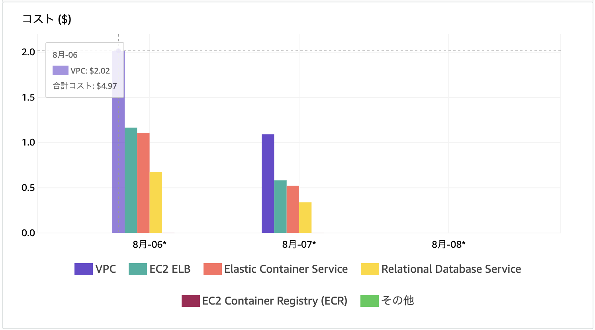

# Fargate with Rails

## 作成したもの

1. ALB(PublicSubnet1 & 2), Fargate(PrivateSubnet1 & 2), DB(PrivateSubnet1 & 2)それぞれにセキュリティグループを作成してサクセスを制限
2. Fargate(Blue/Green Update)
3. Github Actions(deploy)
    1. Docker Image build
    2. ECRにプッシュ
    3. Fargateのタスク定義作成
    4. Blue/Green Update
4. deploy_stack.sh(CloudFormation用)

### Subnet
1. PublicSubnet1(AvailabilityZone: a)
2. PublicSubnet2(AvailabilityZone: d)
3. PrivateSubnet1(AvailabilityZone: a)
4. PrivateSubnet2(AvailabilityZone: d)

### Security Group
1. ALB Security Group      => ALB用
2. Service Security Group  => ECS Fargate用、 Security Groupからのアクセスのみ許可
3. DB Security Group       => DB用、Service Security Groupからのアクセスのみ許可
4. Endpoint Security Group => Fargete作成時にECRにアクセス & Log用、Service Security Groupからのアクセスのみ許可

### Fargete作成用Endpoint
1. ecr.api(PrivateSubnet)
2. ecr.dkr(PrivateSubnet)
3. log(PrivateSubnet)
4. S3(Gateway)

CF. [Amazon ECR インターフェイス VPC エンドポイント (AWS PrivateLink)](https://docs.aws.amazon.com/ja_jp/AmazonECR/latest/userguide/vpc-endpoints.html)


## deploy
CF. [aws/deploy_stack.sh](aws/deploy_stack.sh)

### テンプレートの保存先S3作成(初回のみ)
```
aws s3 mb s3://soda-2022-08 --profile default --region ap-northeast-1
```

### Cloud Formationデプロイ
```
aws cloudformation package \
    --template-file aws/main.yml \
    --s3-bucket soda-2022-08 \
    --output-template-file .aws/artifact.yml \
    --profile default \
    --region ap-northeast-1

aws cloudformation deploy \
    --template-file .aws/artifact.yml \
    --stack-name soda-demo \
    --capabilities CAPABILITY_NAMED_IAM \
    --profile default \
    --region ap-northeast-1
```

### ECRにプッシュ
※上のCloudFormationがFargateを作り始める前に実行の必要あり

```
aws ecr get-login-password \
    --region ap-northeast-1 \
    --profile default |
    docker login \
    --username AWS \
    --password-stdin XXXXXXXXXX.dkr.ecr.ap-northeast-1.amazonaws.com

docker build -t soda-2022-08 .

docker tag soda-2022-08:latest XXXXXXXXXX.dkr.ecr.ap-northeast-1.amazonaws.com/soda-2022-08:latest

docker push XXXXXXXXXX.dkr.ecr.ap-northeast-1.amazonaws.com/soda-2022-08:latest
```

### ALBのDNS名取得
正常に作成完了していれば表示されるはず
```
aws cloudformation describe-stacks \
    --stack-name soda-demo |
    jq -r '.Stacks[].Outputs[] |
    select(.OutputKey == "ALBEndpoint") |
    .OutputValue'
```

## RDS PostgreSQL versions

```
$ aws rds describe-db-engine-versions --engine postgres --query 'DBEngineVersions[].[DBEngineVersionDescription,EngineVersion,Status]' --output table

-----------------------------------------------
|          DescribeDBEngineVersions           |
+----------------------+--------+-------------+
|  PostgreSQL 10.17-R1 |  10.17 |  available  |
|  PostgreSQL 10.18-R1 |  10.18 |  available  |
|  PostgreSQL 10.19-R1 |  10.19 |  available  |
|  PostgreSQL 10.20-R1 |  10.20 |  available  |
|  PostgreSQL 11.12-R1 |  11.12 |  available  |
|  PostgreSQL 11.13-R1 |  11.13 |  available  |
|  PostgreSQL 11.14-R1 |  11.14 |  available  |
|  PostgreSQL 11.15-R1 |  11.15 |  available  |
|  PostgreSQL 12.7-R1  |  12.7  |  available  |
|  PostgreSQL 12.8-R1  |  12.8  |  available  |
|  PostgreSQL 12.9-R1  |  12.9  |  available  |
|  PostgreSQL 12.10-R1 |  12.10 |  available  |
|  PostgreSQL 13.3-R1  |  13.3  |  available  |
|  PostgreSQL 13.4-R1  |  13.4  |  available  |
|  PostgreSQL 13.5-R1  |  13.5  |  available  |
|  PostgreSQL 13.6-R1  |  13.6  |  available  |
|  PostgreSQL 14.1-R1  |  14.1  |  available  |
|  PostgreSQL 14.2-R1  |  14.2  |  available  |
+----------------------+--------+-------------+
```


## ALBのヘルスチェックが通らない
### 解決方法 => HostAuthorizationを使用しない
`config.middleware.delete ActionDispatch::HostAuthorization`

CF. [Rails6のActionDispatch::HostAuthorizationとELBのヘルスチェックの共存](https://qiita.com/reireias/items/544a93c567a153c3ad8f)

## ローリングアップデート
二つ目のタスクが起動後5~6分後に一つ目のタスクが停止する

タスクが二つある時は順番(ランダムの可能性もあり)に表示される

### gitignoreを考慮
1. bin/
```
bundle exec rake app:update:bin
```

2. config/master.key

`RAILS_MASTER_KEY`を設定


## Blue/Green

[CloudFormationでECSのBlue/Greenデプロイができるようになったので試す](https://bluepixel.hatenablog.com/entry/2020/05/23/191401)

### 公式さんはCloudFormaionからBlue/Greenデプロイを実行するなら可能と言ってるけど、制約が多くて使いづらそう
[AWS CloudFormation を使用して CodeDeploy を通じて ECS ブルー/グリーンデプロイを実行する](https://docs.aws.amazon.com/ja_jp/AWSCloudFormation/latest/UserGuide/blue-green.html)

### 制約が多くて使いづらそう
[CloudFormation を使用して ECS ブルー/グリーンデプロイメントを管理する際の考慮事項](https://docs.aws.amazon.com/ja_jp/AWSCloudFormation/latest/UserGuide/blue-green.html#blue-green-considerations)
- ECSタスク定義もしくはECSタスクセットと同時に、他のリソースの変更できない
- 動的な参照を使用してParameter StoreやSecrets Managerなどの外部サービスから値を取得できない
- 進行中のグリーンデプロイをキャンセルするには、CodeDeploy または ECS ではなく、CloudFormation でスタックの更新をキャンセル
- 出力値の宣言や他のスタックからの値のインポートはできない
- ネストされたスタックリソースを使用できない

### 自分でCodeDeploy定義すればいけるのでは？
[aws-actions/amazon-ecs-deploy-task-definition](https://github.com/aws-actions/amazon-ecs-deploy-task-definition#aws-codedeploy-support)を使えばいけそうな予感


### DeploymentGroupがECSサポートしていない問題
> For blue/green deployments, AWS CloudFormation supports deployments on Lambda compute platforms only. You can perform Amazon ECS blue/green deployments using AWS::CodeDeploy::BlueGreen hook. See Perform Amazon ECS blue/green deployments through CodeDeploy using AWS CloudFormation for more information.

[AWS::CodeDeploy::DeploymentGroup](https://docs.aws.amazon.com/ja_jp/AWSCloudFormation/latest/UserGuide/aws-resource-codedeploy-deploymentgroup.html#cfn-codedeploy-deploymentgroup-deploymentstyle)

[cliと併せて頑張るって方法もあるっぽい](https://qiita.com/neruneruo/items/d62140f29f067b28925b#%E8%BF%BD%E8%A8%98)

### [us-east-1で動くって](https://github.com/aws-cloudformation/cloudformation-coverage-roadmap/issues/483#issuecomment-1100238755)
> I just tested in us-east-1 as well and I was able to deploy my CFN stack with the DeploymentGroup successfully.

`ap-northeast-1`でも動いた。


aws cloudformation describe-stacks --stack-name soda-demo | jq -r '.Stacks[].Outputs | map(select(.ExportName=="soda-demo-FargateStack-1USJFEJD3VDEK-TaskDefinition"))[] | .OutputValue'

aws cloudformation describe-stacks --stack-name soda-demo | jq -r '.Stacks[].Outputs[]  | select(.OutputKey == "TaskDefinition") | .OutputValue'

aws ecs describe-task-definition --task-definition soda-demo-FargateStack-1USJFEJD3VDEK-TaskDefinition-8epMNm7b3uVt --query taskDefinition > aws/task-definition.json

## Cost
$5/day ぐらい

